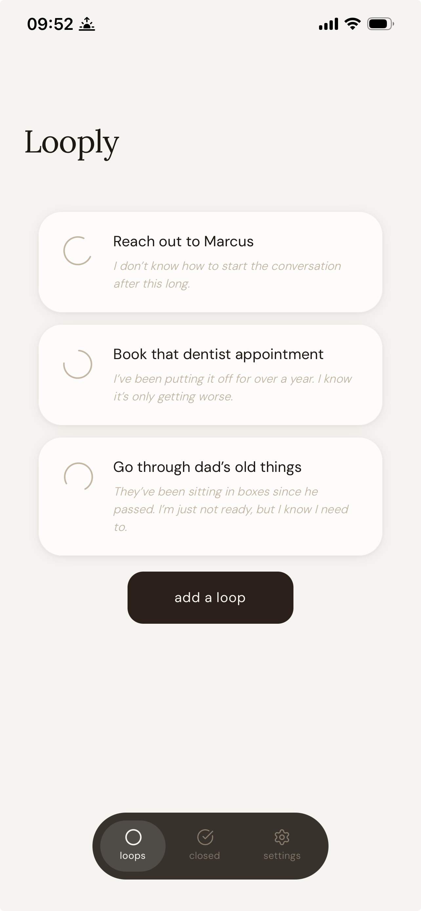

# Looply


A mindful app for closing the open loops that live rent-free in your head. Not your grocery list — the harder stuff. The conversation you're avoiding. The decision you keep postponing. The thing you've been meaning to do for months.

**[Live Demo](https://looply-sigma.vercel.app)**



---

## Features

- **Open loops** — Add the things weighing on your mind with a title and an optional reason for why it's hard to close
- **Close or release** — Close a loop when you've done the thing, or consciously release it and let it go
- **Satisfying animations** — Each action has a distinct, intentional animation that makes closing loops feel meaningful
- **Closed loops history** — Review what you've closed, with the option to restore or delete
- **Onboarding** — A short intro that explains the concept before you dive in
- **Settings** — Reset the app, revisit the onboarding, or read the terms and privacy policy
- **PWA-ready** — Works in the browser and can be installed on your home screen
- **Local storage** — No account required, all data stays on your device

---

## Tech Stack

- **Next.js 15** — React framework with App Router
- **TypeScript** — Type safety throughout
- **Tailwind CSS** — Utility-first styling
- **Framer Motion** — Animations
- **localStorage** — Client-side data persistence
- **Vercel** — Deployment

---

## Getting Started

### Prerequisites

- Node.js v18+

### Installation

```bash
git clone https://github.com/NikolaiVFredriksen/Looply
cd looply
npm install
```

### Run Locally

```bash
npm run dev
```

Open [http://localhost:3000](http://localhost:3000) in your browser.

---

## Project Structure

```
app/
├── components/
│   └── Navbar.tsx          # Bottom pill navigation
├── closed/
│   └── page.tsx            # Closed loops history
├── onboarding/
│   └── page.tsx            # Onboarding slides
├── settings/
│   └── page.tsx            # Settings, terms and privacy
├── layout.tsx              # Root layout with fonts
├── page.tsx                # Main loops page
└── globals.css             # Global styles and animations
```

---

## Author

Nikolai Villanueva Fredriksen  
[GitHub](https://github.com/NikolaiVFredriksen)
